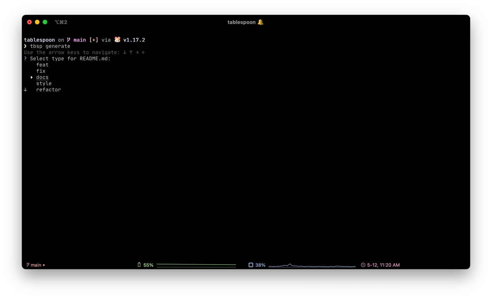

import Bleed from 'nextra-theme-docs/bleed'
import Page from '../components/Page.jsx'

<Page />

# Tablespoon

**tablespoon** is a cli tool used to generate semantic and accurate commit messages.

It is made to help enforce best practices, to improve the readability, and clarity between commits. **Tablespoon** follows the [semantic commits](https://gist.github.com/joshbuchea/6f47e86d2510bce28f8e7f42ae84c716) provided by [@joshbuchea](https://gist.github.com/joshbuchea) on GitHub. It also supports the addition of more types for semantic commits via the [config](/references/config) file, along with custom [aliases](/references/alias).

Here's an example of what it will look like:

<Bleed></Bleed>
